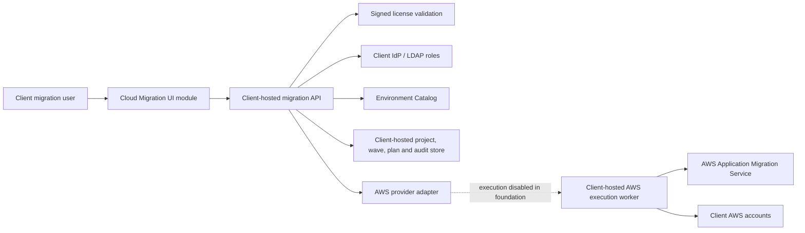

# Cloud Migration Factory: AWS enterprise model

## Repository and release strategy

Cloud Migration Factory remains part of the existing Horizon product repositories so it can reuse authentication, licensing, the Environment Catalog, deployment packaging, and operations. It is isolated as a domain module rather than being implemented inside the pipeline form.

- UI module: `src/modules/cloudMigration`
- Backend domain: `cloud_migration`
- Development branch: `feature/cloud-migration-enterprise` in both repositories
- Release path: feature branch -> client validation -> pull request -> main/production

AWS is the first provider. Azure, Google Cloud, and OCI must implement the provider adapter contract after the AWS lifecycle is production-ready; they must not be emulated through AWS workflows.

## Client-hosted trust boundary

The platform is installed in the client's Kubernetes and cloud environment. These records remain in the client domain:

- server inventory and discovery metadata;
- cloud account identifiers, role ARNs, and credentials;
- migration plans, wave status, logs, approvals, and evidence;
- replication state and cutover actions.

The vendor-side licensing service, when online sync is enabled, receives only the minimal installation and entitlement metadata already defined by the license subsystem. Migration inventory and execution data are not part of license sync or usage reporting.

The application never accepts long-lived AWS access keys. AWS execution workers must use client-controlled workload identity or short-lived assumed roles. An offline signed license remains supported for disconnected installations.

## Control-plane architecture



The API is the system of record. Browser local storage is not an authority for tenant identity, entitlements, account scope, plans, or approvals.

## Licensing

The AWS module requires all of the following entitlements:

- enabled pipeline: `Cloud Migration Factory`
- enabled feature: `cloud_migration`
- enabled feature: `cloud_migration_aws`
- target environment in `allowed_environments`
- target account in `allowed_aws_account_ids` when that restriction is populated
- installation ID match when the license is installation-bound

License validation runs server-side for project creation, wave creation, planning, approval, list, and read operations. Data is tenant-scoped by the `client_id` from the installed license; it is not accepted from a browser request.

## Migration roles

| Role | Read | Create project/wave | Generate plan | Approve |
|---|---:|---:|---:|---:|
| `platform-admin` | yes | yes | yes | yes* |
| `migration-architect` | yes | yes | yes | no |
| `migration-operator` | yes | yes | yes | no |
| `migration-approver` | yes | no | no | yes |
| `migration-auditor` | yes | no | no | no |

\* Self-approval is blocked by default even when a user has multiple roles. Set `CLOUD_MIGRATION_ALLOW_SELF_APPROVAL=true` only if the client explicitly accepts that reduced separation of duties.

Client LDAP/IdP groups map to these roles through `ldap.roleGroupMappings` in Helm values.

## AWS-first workflow implemented

1. An architect creates a project for an active Environment Catalog target.
2. The backend resolves the target account, Region, and role; the browser cannot override the account.
3. An architect or operator creates a wave containing source references and chooses AWS MGN or AMI/snapshot copy.
4. The AWS adapter generates a versioned plan and checks target account, target Region, target role, workload inventory, and source Region requirements.
5. A different approver approves the exact plan version.
6. Every state-changing action writes a client-tenant audit event.

Plan regeneration invalidates an earlier approval. Optimistic version checks prevent an approval from being applied to a stale plan.

## API surface

All endpoints are under `/pipeline/api/cloud-migration` at runtime.

- `GET /capabilities`
- `GET|POST /projects`
- `GET /projects/{project_id}`
- `GET|POST /projects/{project_id}/waves`
- `POST /waves/{wave_id}/plan`
- `POST /waves/{wave_id}/approve`
- `GET /audit-events`

## Deployment configuration

The Helm chart exposes:

```yaml
cloudMigration:
  enabled: true
  dataBoundary: client-hosted
  allowSelfApproval: false
  aws:
    enabled: true
    executionEnabled: false
```

SQLite on the client PVC remains the default for a small installation. Production clients can provide a PostgreSQL SQLAlchemy URL with `database.existingSecret`; schema migrations and database backup/restore must be included in the production release runbook.

## Required next AWS execution increment

`cloudMigration.aws.executionEnabled` intentionally defaults to `false`. Planning and approval must not imply that workload migration has occurred. Before execution is enabled, add and validate:

1. a separate client-hosted worker with a narrow IAM role and durable job queue;
2. AWS identity preflight using STS and explicit source/target account checks;
3. MGN initialization, staging subnet, security group, TCP 443 endpoint, and TCP 1500 replication checks;
4. source server discovery/import and idempotent replication job reconciliation;
5. test-launch, smoke-test evidence, cutover-ready approval, cutover, rollback, and finalization states;
6. encrypted evidence/log storage, retry policy, concurrency controls, quotas, and operational alerts;
7. PostgreSQL migrations, backup/restore testing, high availability, and disaster recovery;
8. client acceptance testing with representative Linux and Windows workloads.

Infrastructure-as-code should provision the AWS landing-zone and MGN prerequisites. The migrated EC2 workload must be created from the replicated source disks through the provider migration service, not from an unrelated clean operating-system image.

## Adding later providers

Each provider gets its own adapter and entitlements, for example `cloud_migration_azure`, `cloud_migration_gcp`, or `cloud_migration_oci`. Shared project, wave, RBAC, license, approval, audit, and UI concepts remain provider-neutral; identity, preflight, replication, test launch, cutover, rollback, and evidence logic remain provider-native.
