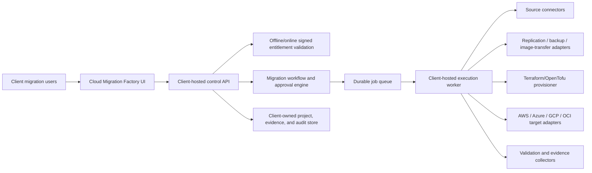

# Cloud Migration Factory: provider-neutral rehost architecture

## 1. Executive decision

Cloud Migration Factory should remain one licensed, client-hosted control plane, but its execution design must not be tied directly to AWS MGN or to a single cloud provider.

The product should support three clearly separated server-migration patterns:

1. **Continuous replication rehost** - replicate the complete source server and launch a target-cloud VM with minimal application change.
2. **Backup and restore rehost** - restore a protected VM or its disks through a product such as Druva, Veeam, or another client-approved recovery platform.
3. **Compliant rebuild** - build a new VM from a patched, hardened golden image, then migrate the application, configuration, and data onto it.

The third pattern is not a strict lift-and-shift because the operating system is replaced. It is a controlled rebuild, sometimes described as replatform-light. It requires broader testing than a block-level rehost.

AWS remains the first production implementation. Azure, Google Cloud, and Oracle Cloud Infrastructure (OCI) should reuse the same project, discovery, wave, approval, evidence, and lifecycle model while implementing provider- and tool-specific execution adapters.

## 2. What is correct in the supplied process

The supplied process correctly includes the enterprise activities that are often missing from simple migration diagrams:

- application discovery and dependency mapping;
- target landing-zone preparation;
- source-monitoring suppression during cutover;
- backup or replication health validation;
- encrypted target storage and images;
- technical, security, and business acceptance tests;
- Infrastructure as Code for repeatability;
- DNS/load-balancer cutover;
- rollback and source-retirement controls;
- monitoring, CMDB, backup, patching, and operational handover.

These controls should be retained as the enterprise baseline.

## 3. Required correction: rehost image versus golden image

The product must distinguish these artifacts:

| Artifact | Purpose | Contains source application/data? | Normal use |
|---|---|---:|---|
| Provider base image | Vendor-supported operating-system starting point | No | New build or compliant rebuild |
| Enterprise golden image | Patched and hardened organization baseline | No, unless intentionally baked | Compliant rebuild |
| Replicated source disks | Latest operating system, application, configuration, and attached block data | Yes | Continuous rehost |
| Restored recovery image | VM state restored by backup/DR tooling | Yes | Backup/restore rehost |
| Post-migration machine image | Validated target VM captured after migration | Yes | Recovery, repeatable rebuild, or scale-out when safe |

For a true rehost, the cutover VM must be launched from the latest replicated or restored source state. A clean golden image must not silently replace the replicated boot disk.

For a compliant rebuild, the target is intentionally created from a golden image. The workflow then installs the application and migrates configuration and data. This needs application-level validation, identity regeneration, data synchronization, and a separate rollback plan.

Terraform should provision the landing zone and surrounding infrastructure before migration. During continuous replication, the native migration service normally creates the test and cutover VM. After acceptance, the product can import/adopt the resulting VM into infrastructure management or capture a provider-native image. It should not create an older AMI/image between initial replication and cutover and then lose subsequent source changes.

## 4. Provider-neutral architecture



Migration inventory, credentials, plans, logs, evidence, and cloud identifiers stay inside the client domain. Vendor licensing receives only the minimum installation and entitlement metadata and never receives workload inventory or execution logs.

### 4.1 Separate adapters by responsibility

A single provider adapter is insufficient for cross-cloud migration. The execution worker should compose these adapter types:

1. **Source connector**
   - on-premises physical server;
   - VMware or Hyper-V;
   - AWS EC2;
   - Azure VM;
   - Google Compute Engine;
   - OCI Compute.

2. **Discovery adapter**
   - client CMDB/CSV;
   - native cloud inventory;
   - RVTools or virtualization inventory;
   - client-approved discovery tools.

3. **Transfer adapter**
   - AWS Transform MGN;
   - Azure Migrate and Modernize;
   - Google Migrate to Virtual Machines;
   - Oracle Cloud Migrations;
   - Druva, Veeam, Zerto, or another client-approved tool;
   - virtual-disk/image export and import.

4. **Target provider adapter**
   - identity and account validation;
   - target network and quota checks;
   - target VM configuration;
   - image, encryption, backup, monitoring, and traffic operations.

5. **Infrastructure provisioner**
   - Terraform or OpenTofu plan/apply;
   - state stored in the client-controlled backend;
   - policy-as-code and drift validation.

6. **Validation adapter**
   - operating-system checks;
   - service and endpoint smoke tests;
   - security and vulnerability controls;
   - application tests and business acceptance;
   - evidence collection.

This composition allows, for example, an AWS source connector, Druva transfer adapter, Terraform provisioner, and Azure target adapter to participate in one migration plan.

### 4.2 Minimum adapter contract

Every executable adapter should expose idempotent operations and reconcile external state instead of assuming a request succeeded:

```text
capabilities()
validate_configuration()
discover()
assess()
preflight()
plan()
start_replication_or_restore()
reconcile_replication()
launch_test()
collect_test_evidence()
prepare_cutover()
execute_cutover()
reconcile_cutover()
execute_rollback()
finalize()
collect_evidence()
```

Each operation returns a client-visible job ID, provider/tool resource IDs, timestamps, status, error classification, retry guidance, and evidence references. Mutating operations require an idempotency key and the approved plan version.

## 5. Canonical provider-neutral data model

The core schema should not use `aws_account_id`, `target_aws_role_arn`, or AWS Regions as universal fields. Use provider-neutral records with typed provider configuration.

### 5.1 Cloud environment

```text
CloudEnvironment
  id
  client_id
  provider                  aws | azure | gcp | oci | onprem
  environment_name          dev | qa | stage | prod | dr
  account_scope             provider-neutral display value
  location                  region/zone pair
  identity_profile_ref      reference to client secret/workload identity
  network_profile_id
  encryption_profile_id
  image_policy_id
  backup_profile_id
  monitoring_profile_id
  provider_config_json      validated against provider-specific schema
```

Provider account scope examples:

- AWS: organization/account/Region;
- Azure: tenant/subscription/resource group/Region;
- GCP: organization/folder/project/Region/zone;
- OCI: tenancy/compartment/Region/availability domain.

### 5.2 Workload asset

```text
WorkloadAsset
  source_provider
  source_native_id
  hostname
  application_id
  environment
  owner
  os_family/version/architecture
  firmware/boot_mode
  cpu/memory/utilization
  disks/filesystems/encryption
  network_interfaces/addresses/ports
  dependencies
  database_and_shared_storage_refs
  identity/domain/certificate dependencies
  backup_and_monitoring state
  data_classification/compliance
  rto/rpo/downtime tolerance
  migration_constraints
```

### 5.3 Migration plan

The immutable plan version should include:

- source and target environment IDs;
- strategy and transfer adapter;
- workload inventory snapshot hash;
- target sizing and cost estimate;
- landing-zone Terraform plan reference and hash;
- target image policy and encryption keys;
- replication/restore settings;
- dependency migration order;
- test cases and acceptance thresholds;
- maintenance window and freeze procedure;
- DNS/load-balancer change plan;
- backup, rollback, and data-reconciliation plan;
- approvals and segregation-of-duty requirements;
- evidence retention and data residency policy.

Any material change invalidates the approval and creates a new plan version.

## 6. Generic end-to-end rehost lifecycle

### Phase 0 - License and client onboarding

1. Validate the signed Cloud Migration Factory license.
2. Validate provider and adapter entitlements.
3. Map client IdP groups to architect, operator, approver, security, application owner, and auditor roles.
4. Register source and target environments using secret references or workload identity; never store long-lived credentials in the browser or database.

### Phase 1 - Discover

1. Import inventory from CMDB, CSV, provider APIs, or a discovery appliance.
2. Collect performance for a representative period rather than sizing only from allocated CPU/RAM.
3. Discover application, database, file-share, network, DNS, identity, certificate, batch, and monitoring dependencies.
4. Mark unsupported or incomplete assets as blocked.

### Phase 2 - Assess and select strategy

For each workload, choose one of:

- continuous replication rehost;
- backup/restore rehost;
- image export/import;
- compliant rebuild from golden image;
- replatform to containers/managed service;
- retain, retire, or replace.

The assessment must check operating system and CPU architecture, boot mode, drivers/guest agents, attached versus shared storage, encryption, licensing/BYOL, clustered applications, data consistency, bandwidth, egress charges, downtime, RTO/RPO, and target-provider support.

### Phase 3 - Build migration waves

Group servers by application and dependency, not merely by server count. Define migration order, maintenance window, business owner, test owner, change ticket, rollback authority, and communication bridge.

### Phase 4 - Prepare landing zone with IaC

Terraform/OpenTofu provider modules create or validate:

- account/project/subscription/compartment placement;
- VPC/VNet/VCN, subnets, routes, DNS, VPN/private connectivity, firewall controls, and endpoints;
- workload identities and least-privilege roles;
- encryption keys and key policies;
- migration staging resources;
- target image gallery/repository;
- VM profiles, load balancing, backup, monitoring, vulnerability management, tags, budgets, and quotas.

The plan passes policy-as-code, security, cost, and change approval before apply.

### Phase 5 - Prepare target image policy

Select one path explicitly:

- **Replicated source image:** retain the source operating system and apply approved post-launch remediation.
- **Restored recovery image:** restore through the backup platform and validate crash/application consistency.
- **Golden-image rebuild:** select the approved image family/version, install the application through configuration automation, and migrate application data separately.

Record the image ID/version, build pipeline, patch date, vulnerability result, encryption key, architecture, OS license, lineage, and expiry date.

### Phase 6 - Run live preflight

The client-hosted worker validates:

- source and target identities and exact account scopes;
- required API/service enablement;
- least-privilege permissions;
- source-to-target control and data paths;
- staging subnet capacity, routes, firewall rules, proxies, DNS, and time synchronization;
- storage, snapshots, image, VM, IP, and API quotas;
- encryption-key access;
- target boot compatibility and required guest agents;
- backup and rollback readiness.

Planning messages are not evidence of connectivity. Preflight must execute live checks and store their results.

### Phase 7 - Approve exact plan version

A different authorized approver reviews the immutable plan, Terraform plan, security result, rollback, downtime, cost, and evidence. Approval produces a signed audit event. The worker refuses execution if the approved version no longer matches the active plan.

### Phase 8 - Replicate, restore, or rebuild

The selected transfer adapter starts the job. The worker polls and reconciles the provider/tool state, records lag and recovery points, handles retryable failures, and prevents duplicate jobs.

Shared files, managed databases, object storage, and external data services use separate data-migration plans. A VM block-replication job must not imply that NAS, SMB/NFS shares, managed databases, or external volumes were migrated.

### Phase 9 - Launch isolated test VM

1. Launch into the target test subnet without production traffic.
2. Prevent duplicate scheduled jobs, outbound integrations, email, or production writes.
3. Replace source-cloud guest agents and configuration where required.
4. Validate boot, disks, domain/identity, certificates, application services, database/file connections, logs, backup, monitoring, security tools, performance, and business transactions.
5. Patch or remediate only through an approved, repeatable automation step.

### Phase 10 - Cutover readiness gate

Confirm healthy replication/latest recovery point, successful test evidence, current backup, frozen target configuration, DNS TTL, communication, source monitoring maintenance window, data freeze/final synchronization, business go/no-go, and named rollback authority.

### Phase 11 - Cut over

1. Freeze source writes and application changes.
2. Perform final synchronization and verify lag/recovery point.
3. Launch or promote the target VM.
4. Run technical smoke tests before sending traffic.
5. Update DNS, load balancer, routes, or upstream integrations.
6. Enable target monitoring and observe application and business indicators.
7. Keep the source protected from conflicting writes.

### Phase 12 - Stabilize or roll back

During the rollback window, compare errors, latency, capacity, security alerts, data integrity, jobs, and business transactions with the baseline.

Rollback must explicitly cover traffic reversal and data. Most replication tools do not automatically copy writes made on the target back to the source. The plan must define reverse replication, dual-write, transaction replay, database recovery, or accepted data loss before cutover approval.

### Phase 13 - Finalize and hand over

After business acceptance and the rollback hold period:

1. finalize/disconnect the migration tool;
2. capture the target-native image when appropriate;
3. adopt/import target resources into infrastructure management;
4. enable normal monitoring, backup, patching, vulnerability management, and cost ownership;
5. update CMDB, operations runbooks, service ownership, and disaster recovery;
6. archive evidence and close the migration wave;
7. retire the source through a separate approved decommission process.

## 7. Cross-cloud migration handling

Cloud-to-cloud rehost is possible, but an AWS AMI, Azure image, GCP image, and OCI custom image are not universally interchangeable. The target adapter must convert storage, install target guest drivers/agents, rebuild identity and networking, and re-encrypt with target-owned keys.

### 7.1 Preferred execution path by target

| Target | Preferred native path | Directly documented sources | Fallback |
|---|---|---|---|
| AWS | AWS Transform MGN | Physical, virtual, and cloud-hosted supported servers | Druva/Veeam/Zerto or supported VM image import |
| Azure | Azure Migrate and Modernize physical/other-cloud workflow | Physical servers and VMs in AWS, GCP, or other clouds | Backup/replication partner or supported VHD/image import |
| GCP | Migrate to Virtual Machines | vSphere, AWS, Azure, and Google Cloud VMware Engine | Migrate-to-VMs image import, virtual disk import, or partner tool |
| OCI | Oracle Cloud Migrations | VMware vSphere and EBS-backed x86 AWS EC2 | Custom image import, backup/replication partner, or compliant rebuild |

The product capability API must generate this matrix dynamically from installed adapter versions. It must block unsupported source/target combinations rather than presenting every combination as executable.

### 7.2 Examples

#### AWS to Azure

1. Discover the EC2 server using the Azure Migrate physical/other-cloud pattern.
2. Build the Azure landing zone and Managed Identity/RBAC with Terraform.
3. Replicate disks with Azure Migrate or a client-approved transfer adapter.
4. Test as an Azure VM; replace AWS-specific agents, instance metadata assumptions, IAM roles, and CloudWatch integration.
5. Rebuild identity using Managed Identity, re-encrypt with Azure Key Vault-managed keys where required, cut over traffic, and retain the AWS source for rollback.

#### AWS to GCP

1. Register AWS as a source in Migrate to Virtual Machines.
2. Validate snapshot permissions, source Region, target project/Region, egress cost, and target networking.
3. Replicate and test a Compute Engine instance.
4. Replace IAM-instance-profile behavior with a least-privilege GCP service account, replace AWS agents, and configure Cloud Monitoring/Logging.
5. Cut over and finalize only after business acceptance.

#### AWS to OCI

Use Oracle Cloud Migrations for supported EBS-backed x86 EC2 instances. Validate OCI tenancy/compartment, VCN, keys, shapes, OS licensing, Hydration Agent requirements, and target support before replication and test launch.

#### Azure or GCP to AWS

Use AWS Transform MGN for supported cloud-hosted servers. Install the replication agent or supported connector, replicate into the AWS staging subnet, perform test launch, replace source-cloud agents and identity integration, and cut over through the approved AWS plan.

#### Azure to GCP

Use Google Migrate to Virtual Machines' Azure source adapter for supported VMs. Recreate identity, networking, encryption, monitoring, and load balancing in GCP.

#### GCP or another cloud to Azure

Use the Azure Migrate physical/other-cloud workflow for supported machines. Treat each server as an external physical-style source and validate the replication appliance/agent path.

#### Azure/GCP to OCI, or OCI to GCP

Do not claim a native direct path unless the installed adapter explicitly supports it. Select a validated partner transfer tool, a supported virtual-disk/image export-import workflow, or a compliant rebuild. Run a proof of concept for boot drivers, disk layout, licensing, and performance before approving a wave.

#### OCI to AWS or Azure

Treat the OCI instance as a supported external cloud-hosted/physical-style server when the destination-native migration service supports its OS and disk layout. Otherwise use backup/restore or image conversion. Source OCI IAM, VCN, instance principal, Vault, and monitoring configuration must be replaced with target-native controls.

## 8. Cross-cloud risks that must be first-class controls

1. **Identity is not portable.** AWS IAM roles, Azure Managed Identities, GCP service accounts, and OCI dynamic groups must be mapped, not copied.
2. **Encryption keys are not portable.** Target disks/images must be re-encrypted with a client-owned target key. Export may be impossible while a source disk is protected by a non-exportable key.
3. **Networking is not portable.** Private IPs, security groups/firewalls, route tables, load balancers, metadata endpoints, and DNS must be recreated.
4. **Guest integrations differ.** Remove or disable source-cloud agents and install target guest, monitoring, backup, security, and management agents.
5. **Images differ.** Disk formats, firmware, Secure Boot, TPM, device names, drivers, architecture, and license metadata require compatibility checks.
6. **Managed services are not VMs.** Databases, object storage, queues, serverless functions, key vaults, and managed file services need separate migration tracks.
7. **Shared storage may not replicate.** Attached block replication does not automatically move NAS, NFS, SMB, or provider-managed volumes.
8. **Data consistency is application-specific.** Databases and transaction systems need quiescing, application-consistent recovery, or logical replication.
9. **Egress cost and bandwidth matter.** Estimate initial copy, repeated deltas, tests, retries, and final synchronization.
10. **Licensing may change.** Windows, SQL Server, Oracle, SAP, marketplace images, and vendor appliances need BYOL and target-cloud validation.
11. **Rollback is not automatically bidirectional.** Any target writes after cutover require a reconciliation or accepted-loss plan.
12. **Regulated evidence must be immutable.** Record who approved, what version ran, which cloud resources were created, test results, deviations, and final acceptance.

## 9. Proposed UI journey

Replace the current single-page AWS form with a guided project workspace:

1. **Overview** - license, client boundary, overall progress, owners, risks, and change record.
2. **Source and target** - source connector, target provider/environment, live identity validation.
3. **Discovery** - import assets, dependencies, utilization, and data classification.
4. **Assessment** - compatibility, target sizing, strategy recommendation, cost, and blockers.
5. **Waves** - dependency-aware grouping, order, window, RTO/RPO, and rollback authority.
6. **Landing zone** - Terraform plan, policy results, approval, apply, and drift status.
7. **Image and transfer** - replicated source, backup/restore, image import, or golden-image rebuild; adapter capability check.
8. **Preflight** - identity, permissions, network, quota, encryption, and backup checks.
9. **Plan and approval** - immutable version, comparison, separation of duties, and signatures.
10. **Replication/restore** - progress, lag, errors, recovery points, and estimated completion.
11. **Test launch** - isolated VM, automated checks, defects, evidence, and application acceptance.
12. **Cutover** - checklist, go/no-go, final sync, traffic switch, and live status.
13. **Stabilization/rollback** - SLOs, incidents, rollback action, and data reconciliation.
14. **Finalize** - target image, IaC adoption, handover, CMDB, evidence pack, and source-retirement ticket.

The UI should display only methods supported by the selected source, target, OS, architecture, and installed licensed adapters.

## 10. Generic lifecycle states

```text
DRAFT
DISCOVERY_IN_PROGRESS
DISCOVERED
ASSESSMENT_BLOCKED | ASSESSED
PLAN_DRAFT
LANDING_ZONE_PLANNED
LANDING_ZONE_READY
APPROVAL_PENDING
APPROVED
PREFLIGHT_BLOCKED | PREFLIGHT_PASSED
REPLICATION_IN_PROGRESS | RESTORE_IN_PROGRESS | REBUILD_IN_PROGRESS
SYNCED
TEST_LAUNCHING
TEST_FAILED | TEST_PASSED
CUTOVER_APPROVAL_PENDING
CUTOVER_READY
CUTOVER_IN_PROGRESS
STABILIZING
ROLLBACK_IN_PROGRESS | ROLLED_BACK
CUTOVER_COMPLETE
FINALIZATION_PENDING
FINALIZED
FAILED
CANCELLED
```

Project, wave, workload, external job, and evidence states should be separate. The worker derives the wave summary from workload states rather than overwriting all workloads with one coarse status.

## 11. Security, compliance, and evidence model

- Use client workload identity or short-lived role assumption only.
- Store secret references, never secret values, in project records.
- Separate source-read, staging, target-provisioning, cutover, evidence, and application-runtime privileges.
- Require separate plan author, security reviewer where applicable, change approver, and cutover operator.
- Sign or hash immutable plan versions and evidence manifests.
- Encrypt database, object evidence, job logs, backups, images, and Terraform state with client-owned keys.
- Redact access tokens, credentials, connection strings, personal data, and confidential logs.
- Record actor, role, client, installation, operation, plan version, source/target resource IDs, job ID, before/after state, timestamp, result, error, and evidence hash.
- Apply retention/legal-hold policies inside the client environment.
- Provide an exportable evidence pack without sending it to the vendor.

## 12. Changes required from the current AWS foundation

The current implementation is an appropriate planning foundation, but the next design increment should:

1. replace `SourceType = aws-ec2 | external` with provider-neutral source environments and source connectors;
2. replace the hard-coded AWS-only target and license checks with a provider registry and per-provider entitlements;
3. move AWS account/Region/role fields into typed AWS environment configuration while adding Azure, GCP, OCI, and on-premises schemas;
4. split the current adapter into source, transfer, target, IaC, and validation adapter contracts;
5. extend the adapter beyond `capabilities()` and `build_plan()` to the complete execution/reconciliation lifecycle;
6. add discovery assets, dependencies, assessments, image policies, landing-zone plans, external jobs, approval gates, test runs, evidence artifacts, and rollback records;
7. introduce PostgreSQL schema migrations, a durable job queue, leases/heartbeats, idempotency keys, retry classification, concurrency and quota controls;
8. run a separate client-hosted worker with no public ingress and narrowly scoped identities;
9. implement live preflight rather than informational green messages;
10. add a capability matrix that rejects unsupported provider/tool/source combinations;
11. retain the current AWS UI and APIs through a versioned compatibility layer while the guided workspace is introduced;
12. keep execution disabled by default until representative Linux and Windows migrations pass client acceptance testing.

## 13. Recommended implementation sequence

### Release 1 - AWS executable rehost

- AWS source/external source connector;
- AWS Transform MGN transfer adapter;
- Terraform AWS landing-zone module integration;
- live STS/IAM/network/quota/KMS preflight;
- durable worker and job reconciliation;
- replication, test launch, test evidence, cutover approval, cutover, rollback, finalization;
- target-image capture and Terraform adoption only after acceptance;
- representative Linux and Windows acceptance tests.

### Release 2 - Backup/restore and compliant rebuild

- generic transfer-adapter SDK;
- first client-required backup integration, such as Druva;
- image policy and golden-image pipeline integration;
- application/configuration/data synchronization tasks;
- Packer/native image-builder integration where selected by the client;
- stricter testing for rebuilt workloads.

### Release 3 - Azure target

- Azure environment schema and licensing;
- Azure Migrate transfer adapter;
- Azure landing-zone Terraform modules;
- Managed Identity, VNet, Key Vault, Compute Gallery, Monitor, Backup, and traffic adapters;
- AWS/GCP-to-Azure test scenarios.

### Release 4 - GCP target

- GCP environment schema and licensing;
- Migrate to Virtual Machines adapter;
- GCP landing-zone Terraform modules;
- service account, VPC, Cloud KMS, custom image/image family, Operations suite, backup, and traffic adapters;
- AWS/Azure-to-GCP test scenarios.

### Release 5 - OCI target

- OCI environment schema and licensing;
- Oracle Cloud Migrations adapter for supported VMware/AWS sources;
- OCI landing-zone Terraform modules;
- dynamic groups/policies, VCN, Vault, custom images, monitoring, backup, and traffic adapters;
- explicit fallback workflows for unsupported Azure/GCP sources.

## 14. Acceptance criteria for calling the product enterprise-ready

- The worker can safely resume after a restart without duplicating replication, test, cutover, or rollback actions.
- Every mutating operation is bound to one approved immutable plan version.
- A source/target/tool combination is blocked when capability or OS compatibility is unsupported.
- Live identity, network, quota, encryption, and backup preflight evidence exists before execution.
- Linux and Windows test migrations prove replication, test launch, cutover, rollback, and finalization.
- Data and shared-storage exceptions are tracked separately from VM completion.
- Rollback includes traffic and data reconciliation, not only VM shutdown.
- Client inventory, credentials, logs, evidence, and Terraform state remain inside the client domain.
- Licensing gates capability server-side without transmitting workload data to the vendor.
- Evidence is exportable and sufficient to reproduce who approved and executed every migration action.

## 15. Authoritative provider references

- [AWS migration and transfer overview](https://docs.aws.amazon.com/whitepapers/latest/aws-overview/migration-services.html)
- [AWS Transform MGN rehost guidance](https://docs.aws.amazon.com/prescriptive-guidance/latest/migration-database-rehost-tools/mgn.html)
- [EC2 Image Builder](https://docs.aws.amazon.com/imagebuilder/latest/userguide/what-is-image-builder.html)
- [Azure Migrate discovery for physical servers and other clouds](https://learn.microsoft.com/en-us/azure/migrate/tutorial-discover-physical?view=migrate)
- [Azure Migrate physical and public-cloud servers](https://learn.microsoft.com/en-us/azure/migrate/tutorial-migrate-physical-virtual-machines?view=migrate)
- [Azure Image Builder and Compute Gallery](https://learn.microsoft.com/en-us/azure/virtual-machines/linux/image-builder-gallery)
- [Google Migrate to Virtual Machines](https://docs.cloud.google.com/migrate/virtual-machines/docs/5.0)
- [Google migration path selection](https://docs.cloud.google.com/compute/docs/import)
- [Google custom images](https://docs.cloud.google.com/compute/docs/images/create-custom)
- [Oracle Cloud Migrations overview](https://docs.oracle.com/en-us/iaas/Content/cloud-migration/cloud-migration-overview.htm)
- [Oracle Cloud Migrations supported sources](https://docs.oracle.com/en-us/iaas/Content/cloud-migration/cloud-migration-requirements-specifications.htm)
- [OCI custom images](https://docs.oracle.com/en-us/iaas/Content/Compute/Tasks/managingcustomimages.htm)
